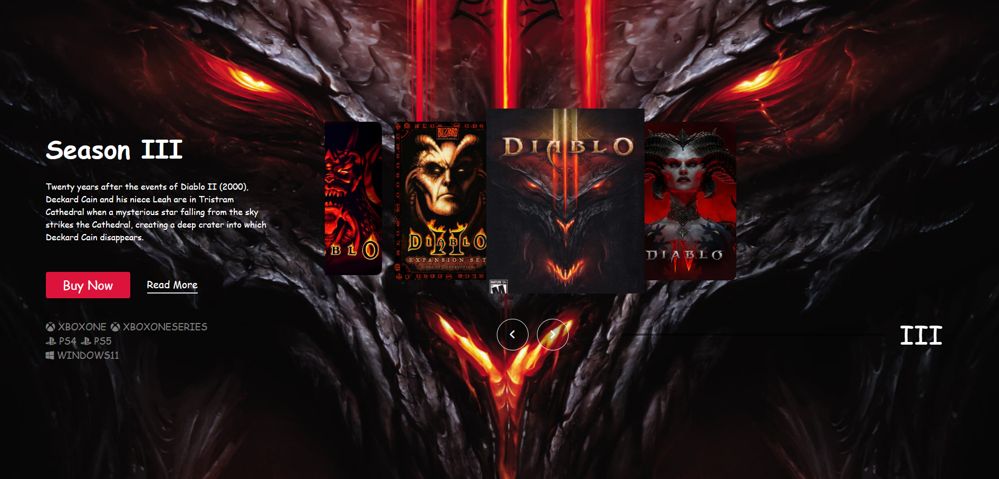

# Game Interface Slider

This project is a game interface slider that allows users to navigate and explore information for different seasons of the game.

## Table of Contents

- [Description](#description)
- [Features](#features)
- [Preview](#preview)

## Description

The Game Interface Slider is designed to provide an interactive way to explore information related to different seasons of a game. It is a user-friendly interface that allows players and fans to access details, updates, and highlights for each season easily.

## Features

- Interactive slider interface for navigating through seasons.
- Information and highlights for each season of the game.
- Engaging visuals and user-friendly design.

## Preview

